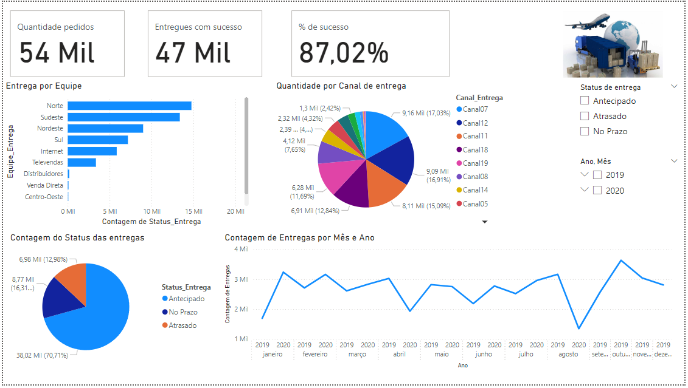

# Analise logistica
Aplicando uma simples analise de dados, utilizando Power BI e python para realizar a visualização, tratamento e previsão.

## Dashboard
Analise de dados

* Possuem uma alta porcentagem de sucesso
* A região Norte e Sudeste possui muita demanda
* O canal 7 e 12 possuem bastante entrega, então devemos ter os melhores
* Temos 70%+ de entregas antecipadas

## Resumo

### Regressão logistica
X = [Equipe_Entrega, Canal_Entrega]

y = Status_Entrega. 

Conseguimos obter uma acuracia de 0.8725435496869381